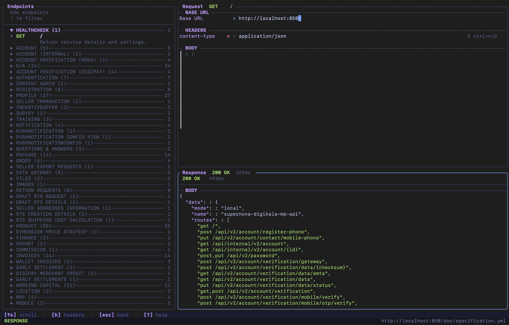
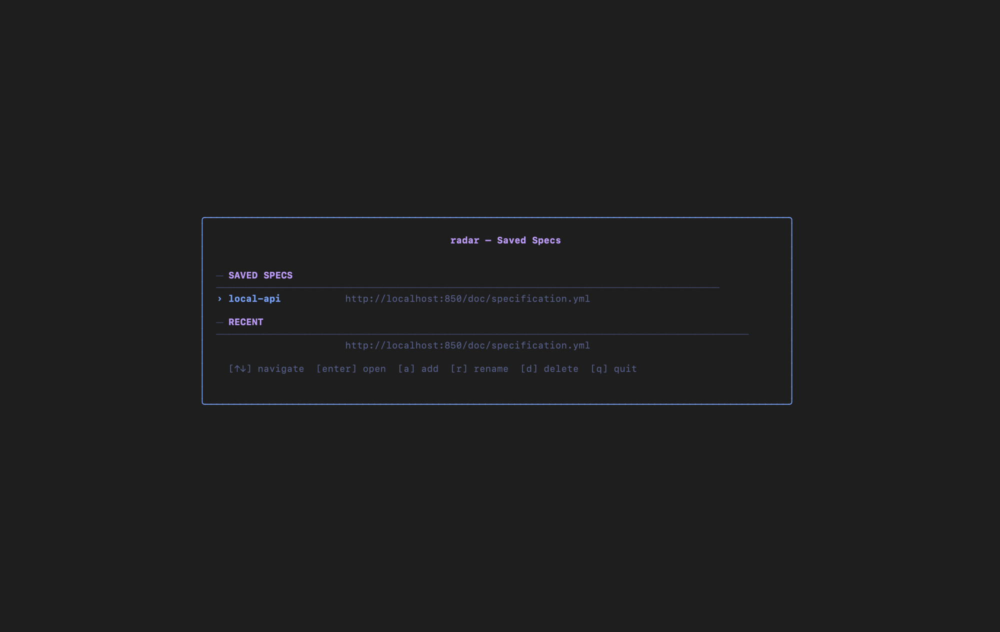
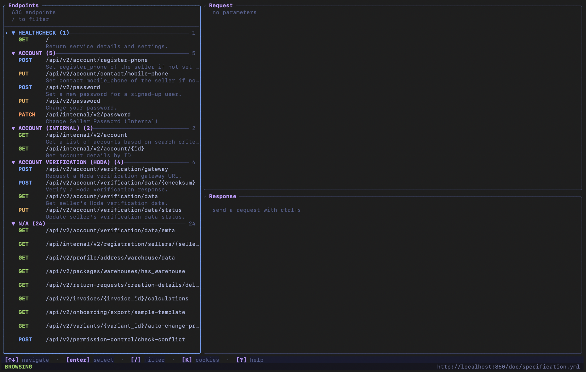

# radar

**A terminal API explorer for OpenAPI / Swagger specifications.**

Browse endpoints, craft requests, and inspect responses — all without leaving your terminal.



---

## Features

- **Browse** all endpoints from any OpenAPI 3.x or Swagger 2.0 spec, grouped by tag with collapsible sections
- **Filter** endpoints live as you type
- **Edit** path params, query params, headers, cookies, and request body (raw JSON or structured fields)
- **Send** requests and inspect status, headers, and pretty-printed JSON responses
- **Save** — every request is auto-saved as an [age](https://age-encryption.org/)-encrypted session file and restored next time you open the same endpoint
- **Cookie jar** — responses that set cookies are captured automatically; an optional global Authorization header is injected into every request
- **Spec picker** — save frequently used spec URLs and reopen them in one keystroke

---

## Installation

**One-liner (macOS / Linux):**

```sh
curl -fsSL https://raw.githubusercontent.com/shayan-shojaei/radar/main/install.sh | bash
```

**Manual binary** — download from the [releases page](https://github.com/shayan-shojaei/radar/releases) and put it on your `$PATH`.

**From source:**

```sh
go install github.com/shayan-shojaei/radar@latest
```

---

## Quick start

```sh
# Pass the spec URL directly
radar --url https://petstore3.swagger.io/api/v3/openapi.json

# Or as a positional argument
radar https://petstore.swagger.io/v2/swagger.json

# Local file
radar ./openapi.yaml

# No argument — launches the saved-spec picker
radar
```

---

## Screenshots

### Saved spec picker

Launch `radar` with no arguments to open your saved specs.



### Endpoint list

All endpoints grouped by tag. Use `/` to filter, `↑↓` to navigate, `Enter` to select.



### Request editor + response viewer

Fill in params and body, hit `Ctrl+S` to send, and inspect the response inline.


---

## Key bindings

### Endpoint list

| Key | Action |
|---|---|
| `↑ / ↓` or `j / k` | Navigate |
| `Enter` | Select endpoint / toggle tag |
| `z` or `Space` | Toggle tag collapse |
| `C / E` | Collapse all / expand all tags |
| `d` | Cycle summary display (path → path+summary → path+summary+description) |
| `/` | Filter endpoints |
| `K` | Open cookie jar & auth header manager |
| `q` | Quit |

### Request editor

| Key | Action |
|---|---|
| `Tab / Shift+Tab` | Move between fields |
| `Ctrl+S` | Send request |
| `Ctrl+N / Ctrl+P` | Cycle Content-Type options |
| `Ctrl+T` | Toggle body mode (raw JSON ↔ structured fields) |
| `Ctrl+L` | Reload saved session for this endpoint |
| `Ctrl+R` | Clear all fields |
| `Esc` | Back to list |

### Response viewer

| Key | Action |
|---|---|
| `↑ / ↓` | Scroll |
| `H` | Toggle response headers |
| `Esc / Q` | Back to request editor |

### Cookie manager (`K` from list)

| Key | Action |
|---|---|
| `↑ / ↓` | Navigate cookies |
| `Space` | Toggle cookie enabled/disabled |
| `A` | Add a cookie |
| `D` | Delete selected cookie |
| `E / Enter` | Edit the Authorization header |
| `Esc` | Save changes and return to list |

---

## Session & encryption

When you send a request, radar auto-saves the request data (headers, body, cookies, params) to `~/.config/radar/sessions/<hostname>.age`. These files are encrypted with [age](https://age-encryption.org/) using a passphrase.

Set `RADAR_PASSPHRASE` in your environment to skip the interactive prompt.

The next time you open the same endpoint, the saved fields are restored automatically. Press `Ctrl+L` to force-reload from the session file.

---

## Cookie jar

- Non-HttpOnly cookies returned in `Set-Cookie` headers are **silently added** to the cookie jar and sent automatically on subsequent requests to the same host.
- **HttpOnly cookies** trigger an interactive prompt — press `y` to persist or `n` to discard.
- The cookie jar is shown (and editable) via `K` from the endpoint list.
- An optional global **Authorization** header can be set in the cookie manager; it is injected automatically into every request that does not already have one.

---

## Spec management

Saved specs are stored as plain JSON in `~/.config/radar/specs.json`.

| Action | How |
|---|---|
| Add a spec | Run `radar` (no args) → press `a` |
| Rename a spec | `radar` → navigate to it → `r` |
| Delete a spec | `radar` → navigate to it → `d` |
| Open directly | `radar --url <url>` (bypasses picker) |

---

## Configuration

| Variable | Default | Description |
|---|---|---|
| `RADAR_STORAGE_DIR` | `~/.config/radar` | Directory for session files and specs list |
| `RADAR_TIMEOUT` | `30` | HTTP request timeout (seconds) |
| `RADAR_PASSPHRASE` | *(prompt)* | Session encryption passphrase |

---

## Contributing

1. Fork the repo and clone it
2. `make build` — verify it compiles
3. `make run url=https://petstore3.swagger.io/api/v3/openapi.json` — run locally
4. `make test` — run tests
5. `make lint` — run golangci-lint
6. Open a pull request
